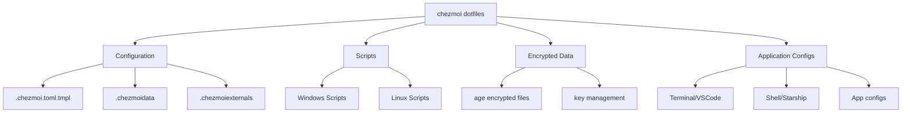
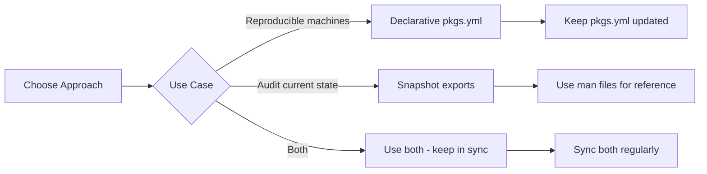
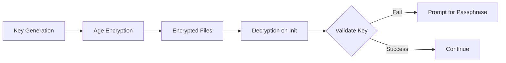

# Chezmoi Dotfiles Inspection Report

## Overview

This document summarizes the defects, issues, and redesign recommendations for the chezmoi-managed dotfiles repository.

---

## Repository Structure



---

## Secret Storage Method

Based on [`README.md`](README.md), secrets are managed using **rage (age)** encryption:

1. **Key Generation**:
   ```bash
   chezmoi cd ~
   rage-keygen -o "key.txt"
   rage -a -p "key.txt" > "key.txt.age"
   ```

2. **Identity Configuration** in `.chezmoi.toml.tmpl`:
   ```toml
   encryption = "age"
   [age]
       command = "rage"
       identity = "~/.config/chezmoi/key.txt"
       recipient = <public-key>
   ```

3. **Data Encryption**:
   - Use `chezmoi add --encrypt [path]` to encrypt files
   - Decrypt in templates using `{{ include "path" | decrypt }}`

4. **Encrypted Files in Repository**:
   - `key.txt.rage` - encrypted identity key
   - `encrypted_data.toml.age` - encrypted config data
   - `encrypted_config.yaml.age` - encrypted aichat config
   - `encrypted_private_id_ed25519.age` - encrypted SSH private key
   - `encrypted_id_codeberg.age` - encrypted Codeberg SSH key
   - `encrypted_config.json.age` - encrypted openlist config
   - `encrypted_data.db.age` - encrypted openlist database

---

## Package Management Approach Analysis

You currently use **two different approaches** for package management:

### Approach 1: Declarative (`.chezmoidata/pkgs.yml`)

```yaml
# Defines what you WANT to install
enabled_roles:
  - base

roles:
  base:
    scoop:
      - name: "7zip"
```

### Approach 2: Snapshot Export (`dot_scoop_man.json`, `dot_winget_man.json`)

Generated by [`run_onchange_after_01-update.ps1`](home/.chezmoiscripts/windows/run_onchange_after_01-update.ps1):
- `scoop export` → Records **currently installed** scoop apps
- `winget export` → Records **currently installed** winget packages

### Comparison

| Aspect | pkgs.yml | scoop_man.json |
|--------|----------|----------------|
| Purpose | Declare desired state | Record actual state |
| Use Case | Auto-installation | Backup/auditing |
| Updates | Manual | Auto-generated |
| Current Apps | Only 7zip | 26 scoop apps |

### Issue Identified

**Inconsistency**: `pkgs.yml` only declares `7zip` for installation, but `dot_scoop_man.json` shows **26 apps** are actually installed. This suggests either:

1. The auto-installation script is not being used effectively, OR
2. The `pkgs.yml` is outdated and doesn't reflect all installed packages

### Recommendation

Choose one approach based on your workflow:



- **If you want reproducible setups**: Use `pkgs.yml` as the source of truth and update it when installing new packages
- **If you want to track what's installed**: Keep using the man files but don't rely on them for installation
- **Best practice**: Use `pkgs.yml` for installation, use man files for documentation/reference

---

## Font Installation Analysis

### Current Issue

The current chezmoiexternals configuration in [`.chezmoiexternals/universal.toml.tmpl`](home/.chezmoiexternals/universal.toml.tmpl) attempts to download fonts from the nerd-fonts release zip:

```toml
[".local/share/fonts/0xProto"]
type = "archive"
url = "https://github.com/ryanoasis/nerd-fonts/releases/download/v3.3.0/0xProto.zip"
```

**Problem**: This approach doesn't work anymore because fonts are not included in the release zip - they must be built from source.

### Recommended Solution: Install Script

Use the official nerd-fonts install scripts instead:

**Windows (PowerShell)**:
```powershell
# Install all fonts (Warning: large download)
.\install.ps1

# Install single font
.\install.ps1 0xProto

# Install multiple fonts
.\install.ps1 Hack,FiraCode

# Dry run
.\install.ps1 Hack -WhatIf
```

**Linux/macOS (bash)**:
```bash
# Install all fonts
./install.sh

# Install single font
./install.sh 0xProto
```

**Script URLs**:
- PowerShell: `https://raw.githubusercontent.com/ryanoasis/nerd-fonts/refs/heads/master/install.ps1`
- Bash: `https://raw.githubusercontent.com/ryanoasis/nerd-fonts/refs/heads/master/install.sh`

### Recommendation

1. **Remove** the chezmoiexternals font configuration
2. **Add** a script to install fonts using the install scripts
3. **Or** keep a small subset of pre-downloaded fonts in the repo if you prefer offline installation

---

## Identified Defects

### 1. Encryption Setup Issues

| Issue | Location | Severity |
|-------|----------|----------|
| Identity path mismatch | [`.chezmoi.toml.tmpl:40`](home/.chezmoi.toml.tmpl:40) | Medium |
| No validation after decryption | [Windows script](home/.chezmoiscripts/windows/run_once_before_00-decrypt-home.ps1.tmpl) | Medium |
| Missing passphrase validation | Both decrypt scripts | Medium |

**Details:**
- The identity is configured as `~/.config/chezmoi/key.txt` but the decryption scripts extract to `$HOME/.config/chezmoi/key.txt`
- No validation that the decrypted key works before proceeding

### 2. Script Bugs

| Issue | Location | Severity |
|-------|----------|----------|
| Path typo in bash script | [`.prepare.sh:37`](home/scripts/.prepare.sh:37) | **Critical** |
| Hardcoded gh-proxy URLs | Multiple files | Low |
| Missing error handling | [`.prepare.ps1`](home/scripts/.prepare.ps1) | Low |

**Details:**
```bash
# BUG: Should be /tmp/rage not tmp/rage
if [ -f "tmp/rage" ]; then  # Line 37 - WRONG
```

### 3. Package Management Inconsistency

| Issue | Location | Description |
|-------|----------|-------------|
| pkgs.yml outdated | [`.chezmoidata/pkgs.yml`](home/.chezmoidata/pkgs.yml) | Only 1 package declared vs 26 installed |
| Redundant data | Both files | Two approaches causing confusion |
| Installation script unused | [`run_onchange_after_00-install-pkg.ps1.tmpl`](home/.chezmoiscripts/windows/run_onchange_after_00-install-pkg.ps1.tmpl) | Script exists but may not be run |

### 4. Font Installation Issue

| Issue | Location | Description |
|-------|----------|-------------|
| chezmoiexternals doesn't work | [`.chezmoiexternals/universal.toml.tmpl`](home/.chezmoiexternals/universal.toml.tmpl) | Fonts not in release zip |
| Need install script approach | N/A | Use nerd-fonts install scripts |

### 5. Configuration Notes

| Item | Location | Notes |
|------|----------|-------|
| SSL verification disabled | [`dot_gitconfig.tmpl:43`](home/dot_gitconfig.tmpl:43) | **Intentional** - Due to network restrictions |
| Mirror URLs | Multiple files | Chinese mirrors (USTC) for better domestic performance |
| API keys in encrypted files | [`dot_config/scoop/config.json.tmpl`](home/dot_config/scoop/config.json.tmpl) | Properly encrypted |

### 6. Missing Features

| Feature | Status | Location |
|---------|--------|----------|
| Linux package installation script | **Missing** | N/A |
| Font installation script | **Needs redesign** | Use install scripts |

---

## Redesign Recommendations

### 1. Encryption System



**Recommendations:**
- Add key validation after decryption to ensure the identity works
- Current rage-based encryption is appropriate for the use case

### 2. Font Installation

**Replace chezmoiexternals with install script:**

```powershell
# Example: Add to your install script
$fontScript = "https://raw.githubusercontent.com/ryanoasis/nerd-fonts/refs/heads/master/install.ps1"
Invoke-WebRequest -Uri $fontScript -OutFile "$env:TEMP\install.ps1"

# Install specific fonts
& "$env:TEMP\install.ps1" 0xProto

# Or install all (warning: large download)
# & "$env:TEMP\install.ps1"
```

### 3. Script Architecture

**Current Problems:**
- Scripts mix installation and configuration
- Path typo in `.prepare.sh`

**Recommendations:**
```powershell
# Example: Better script structure
function Install-Rage {
    param([string]$Version)
    
    # Check if already installed
    if (Get-Command rage -ErrorAction SilentlyContinue) {
        Write-Verbose "rage already installed"
        return
    }
    
    # Use multiple download sources for reliability
    $sources = @(
        "https://github.com/str4d/rage/releases/download/v${Version}/rage-${Version}-x86_64-windows.zip",
        "https://gh-proxy.com/..."
    )
    
    # Install with validation
    foreach ($source in $sources) {
        try {
            # Download and install
            break
        } catch {
            continue
        }
    }
}
```

### 4. Package Management Recommendation

**Choose your approach:**

| Approach | Pros | Cons |
|----------|------|------|
| Declarative (pkgs.yml) | Reproducible, declarative | Must manually update |
| Snapshot (man files) | Auto-updates, reflects reality | Not for installation |
| **Hybrid** | Best of both | Requires sync effort |

**Recommended: Hybrid Approach**
1. Use `pkgs.yml` for declaring packages you want installed
2. Run installation script to install from pkgs.yml
3. Use `run_onchange_after_01-update.ps1` to generate man files for reference
4. Periodically sync pkgs.yml with what's actually needed

### 5. Configuration Management

**Recommendations:**
- Current approach with Chinese mirrors is reasonable for domestic use
- Add environment-based configuration for proxy settings
- Consider making mirror URLs configurable via `.chezmoidata`

---

## Action Items

### High Priority
- [x] Fix path typo in `.prepare.sh` line 37 - change `"tmp/rage"` to `"/tmp/rage"`
- [x] Choose package management approach (hybrid with new naming)
- [x] Replace chezmoiexternals font config with install script approach
- [x] Sync pkgs.yml with actual packages from exports
- [x] Reorder scripts (fonts before packages)

### Low Priority
- [ ] Add encryption key validation
- [ ] Test auto-installation script
- [ ] Improve documentation
- [ ] Implement backup validation

---

## Appendix: File Inventory

| Category | Files |
|----------|-------|
| Config | 15 |
| Scripts | 5 |
| Encrypted | 7 |
| Templates | 8 |
| Application | 12 |

### Package Files

| File | Purpose |
|------|---------|
| `.chezmoidata/pkgs.yml` | Declarative package list (roles: base, dev, utils) |
| `dot_config/scoop/export.json` | Scoop export (26 apps) |
| `dot_config/winget/export.json` | Winget export (50+ packages) |

### Package Roles

```yaml
base:     # Essential tools (git, terminal, editor, fs tools)
dev:      # Development tools (SDKs, build tools)
dotnet:   # Microsoft .NET runtime and SDKs
backup:   # Data recovery (restic, resticprofile, openlist)
utils:    # Utility applications
```

### Script Execution Order

```
01-update.ps1       → Export current packages to ~/.config/
02-install-fonts    → Install Nerd Fonts
03-install-pkg     → Install packages from pkgs.yml
```

### External Resources

| Resource | URL |
|----------|-----|
| Nerd Fonts Install (PS) | `https://raw.githubusercontent.com/ryanoasis/nerd-fonts/refs/heads/master/install.ps1` |
| Nerd Fonts Install (sh) | `https://raw.githubusercontent.com/ryanoasis/nerd-fonts/refs/heads/master/install.sh` |

---

*Generated: 2026-02-17*
